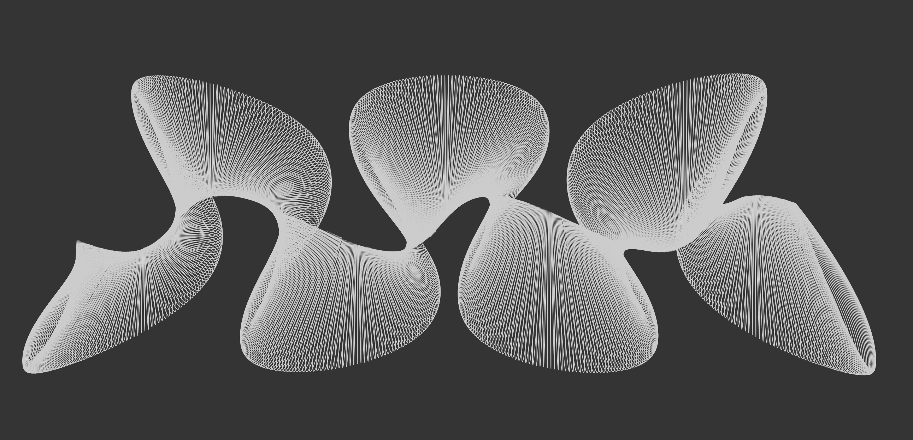
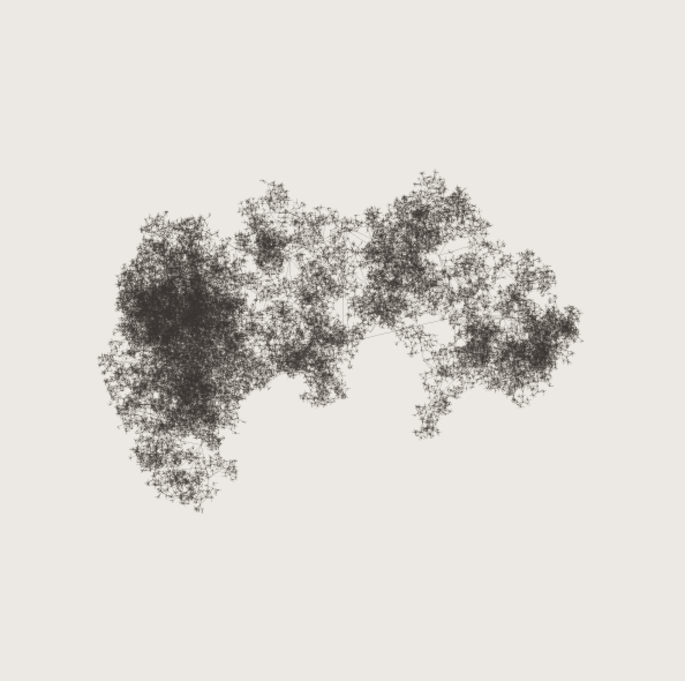
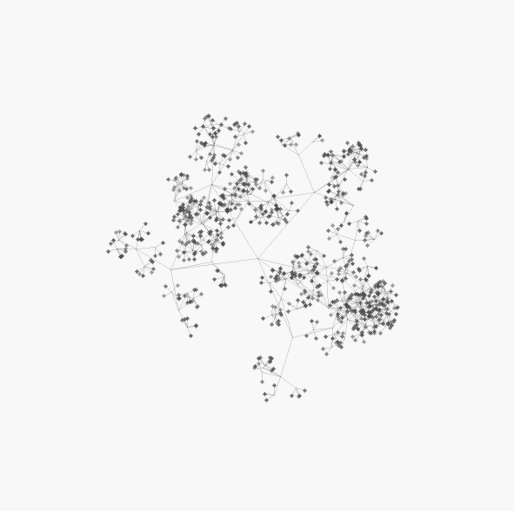

# OppenNative

Experiments with Kotlin Native



## SDL Install

* Linux: `apt-get install libsdl2-dev`  
* MacOS: `brew install sdl2`

Growth Example A            |  Growth Example B
:-------------------------:|:-------------------------:
  |  


## Example Drawing

```
package drawings

import oppen.Drawing
import oppen.shapes.primitives.Line
import oppen.shapes.primitives.Point
import oppen.shapes.primitives.Rectangle
import oppen.stdlib.Degree
import oppen.stdlib.Math
import oppen.stdlib.Math.deg
import oppen.stdlib.Math.map
import oppen.stdlib.Radian
import oppen.stdlib.Random.random

private val lines = mutableListOf<Line>()
private val overlayRect = Rectangle(0, 0, 600, 600)
const val MAX_LINES = 100000f

@ExperimentalUnsignedTypes
class GrowthSDL: Drawing(600, 600) {

    private var reduction = 1.5f

    override fun initialise() {
        spawnNew()
        background(255)
        stroke(0, 32)
        fill(230, 75)
        super.initialise()
    }

    override fun draw() {
        lines.forEach { line ->
            line(line.x1, line.y1, line.x2, line.y2)
        }
        rect(overlayRect)
    }

    override fun key(char: Char?) {
        when(char){
            'N' -> {
                lock()
                spawnNew()
                unlock()
            }
        }
    }

    private fun spawnNew(){
        lines.clear()

        val c = Point(width/2, height/2)
        val length = 100f

        reduction = random(1.6f, 2.2f)

        repeat(random(4, 8)){
            grow(c, length, Math.randomDegree())
        }

        when {
            lines.size < MAX_LINES/3 -> spawnNew()
            else -> {
                val lines = lines.size
                val opacity = map(lines.toFloat(), 0f, MAX_LINES, 128f, 45f)
                strokeOpacity(opacity.toInt())
            }
        }
    }

    private fun grow(p: Point, length: Float, angle: Degree) {
        if (length < 2 || lines.size > MAX_LINES) return

        val p2 = p.plot(angle, length)

        lines.add(Line(p, p2))

        val i = random(3, 8)
        var a: Radian = 0.0
        repeat(i) {
            a += random(-6f, 6f).toDouble()
            grow(p2, length / reduction, a.deg())
        }
    }
}
```

## Drawing Types

OppenNative has two types of Drawing with the same structure but for different purposes:

* Drawing - subclass `Drawing` for animations and interactive work. It utilises SDL for very fast rendering. There's still some work to be done for these Drawing types, especially around complex types (If you look at the example above notice the `lines` and `overlayRect` require global scope, whereas when targetting the JVM in similar projects class scope would be correct, I want to fix this without leaking native/cinterop syntax into the Drawing API).
* SVGDrawing - subclass `SVGDrawing` when you want to render in a single pass and export to SVG **Note: currently broken**. 

## SVG

There's a basic SVG helper to create vector graphics, and all `OppenShape` subclasses have `toSVG()` and `toSVG(colour: String, opacity: Float)` methods:

```
val width = 900
val height = 900
val background = "#ffffff"
val svg = SVG(width, height, background)

val line = Line(0, 0, width, height)
svg.append(line.svg())
println(svg.build())
```

By printing to standard out you can write the output to file, something like: `oppen_drawing.kexe > output.svg`

## Configuration Files

There's support for creating configuration files so you can change Drawing parameters without needing to recompile, see `CatmulRomSplineSVGDrawing` for an example.

```
val configFile = "catmul_rom_test.txt"
val config = ConfigReader(configFile).load()
val width = config.getInt("width") ?: 1200
val height = config.getInt("height") ?: 1200
val iterations = config.getInt("iterations") ?: 700
val speed = config.getFloat("speed") ?: 0.05f
val background = config.get("background") ?: "#ffffff"
```
The config file format is line based:

```
WIDTH: 1200
HEIGHT: 640
ITERATIONS: 800
SPEED: 0.05
BACKGROUND: #1D1D1D
```
